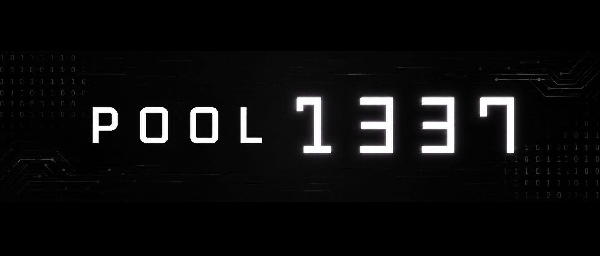

<div align="center">

<<<<<<< HEAD
</img>
=======
```
>>>>>>> c459f91 (update)

[](https://github.com/oakoudad/badge42)

```
**A structured journey through C & Shell Programming**

*1337 / 42 Network — Piscine*

---


</div>

---

## 📌 Overview

This repository documents my progression through the **1337 / 42 Piscine** — an intensive coding bootcamp built around low-level systems programming. Every exercise, rush project, and exam in this repo is a step toward mastering C and Shell from scratch under strict constraints.

> **No copy-paste. No shortcuts. Just clean code, pointers, and pressure.**

---

## 📁 Repository Structure

```
📦 Pool1337/
├── 🐚 Shell00/          # Basic shell navigation & commands
├── 🐚 Shell01/          # Permissions, scripts & automation
├── 💠 C00/              # Basic syntax, loops, output functions
├── 💠 C01/              # Pointers & arrays fundamentals
├── 💠 C02/              # String manipulation
├── 💠 C03/              # Advanced string functions
├── 💠 C04/              # Base conversion & atoi logic
├── 💠 C05/              # Recursion & mathematical logic
├── 💠 C06/              # Program arguments — argc/argv
├── 💠 C07/              # Dynamic memory — malloc/free
├── 💠 C08/              # Structures & headers
├── 💠 C09/              # Libraries & Makefile systems
├── 👥 Rush00/           # Team project I
├── 👥 Rush01/           # Team project II
└── ⏱️  Exam/             # Timed evaluations × 4
```

---

## 📚 Curriculum

### 🐚 Shell Modules

| Module | Topics Covered |
|--------|---------------|
| **Shell00** | File system navigation, basic commands, git basics |
| **Shell01** | Permissions, symbolic links, scripts, automation |

### 💠 C Modules

| Module | Topics Covered |
|--------|---------------|
| **C00** | `write()`, loops, basic output functions |
| **C01** | Pointers, pointer arithmetic, arrays |
| **C02** | `ft_strcpy`, `ft_strlen`, string basics |
| **C03** | `ft_strcat`, `ft_strcmp`, string comparisons |
| **C04** | `ft_itoa`, base conversion, `atoi` reimplementation |
| **C05** | Recursion, Fibonacci, power, square root logic |
| **C06** | `argc`/`argv`, program arguments handling |
| **C07** | `malloc`, `free`, dynamic memory allocation |
| **C08** | Structs, header files, include guards |
| **C09** | Static libraries, `ar`, `Makefile` rules |

### 👥 Rush Projects

| Project | Description |
|---------|-------------|
| **Rush00** | Weekend team project — collaborative problem solving |
| **Rush01** | Advanced teamwork under time pressure |

### ⏱️ Exams

```
┌──────────────────────────────────────────────┐
│  exam00  —  Foundation test                  │
│  exam01  —  Core skills assessment           │
│  exam02  —  Intermediate challenges          │
│  exam03  —  Final evaluation                 │
└──────────────────────────────────────────────┘
```

**Exam constraints:**
- Strict time limits per exercise
- Full Norminette compliance required
- Zero external help allowed
- Graded on correctness + code quality

---

## 🎯 Learning Goals

- [x] Master low-level programming in C
- [x] Deeply understand pointers & memory management
- [x] Implement standard library functions from scratch
- [x] Write clean, readable, constraint-respecting code
- [x] Develop algorithmic thinking under pressure
- [x] Collaborate effectively on team rush projects
- [x] Follow **Norminette** standards strictly

---

## ⚙️ Code Standards

All code in this repository follows the **42 Norm (Norminette)**:

- Functions limited to 25 lines max
- No more than 5 variables per function
- No `for` loops — only `while`
- No assignments inside conditions
- Specific naming conventions enforced
- Zero memory leaks — every `malloc` has a `free`

```bash
# Check norm compliance
norminette file.c

# Compile with full warnings
cc -Wall -Wextra -Werror file.c

# Run with valgrind for leak detection
valgrind --leak-check=full ./a.out
```

---

## 🛠️ Dev Stack

| Tool | Usage |
|------|-------|
| **C** | Primary programming language |
| **GCC** | Compilation with strict flags |
| **Bash** | Shell scripting modules |
| **Vim** | Main editor (as required by the school) |
| **Git** | Version control & submission |
| **Valgrind** | Memory leak detection |
| **Norminette** | Code style enforcement |

---

## 📈 Progress

```
🌱 Day 1    →  "What even is a pointer?"
💡 Week 1   →  "Oh. The address of a variable. Got it."
🔁 Week 2   →  "malloc makes sense now"
✨ Week 3   →  "Recursion = a function calling itself. Magic."
👥 Rush     →  "Teamwork hits different at 3am"
⏱️  Exam     →  "I think in C now"
🚀 End      →  "Ship it."
```

---

## 👤 Author

```
Login   :  Baktrack-sec
School  :  1337 / 42 Network
```

> *"Code is poetry written in logic."*

---

## 📜 License

> ⚠️ For **educational and personal learning** purposes only.
> Not intended for commercial use or direct copying in Piscine submissions.

---

<div align="center">

*Keep pushing. Keep compiling. Keep growing.*

`cc -Wall -Wextra -Werror *.c && ./a.out`

</div>
